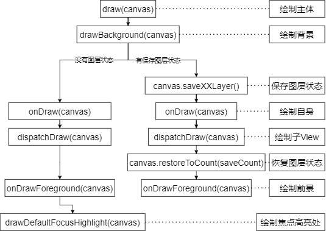
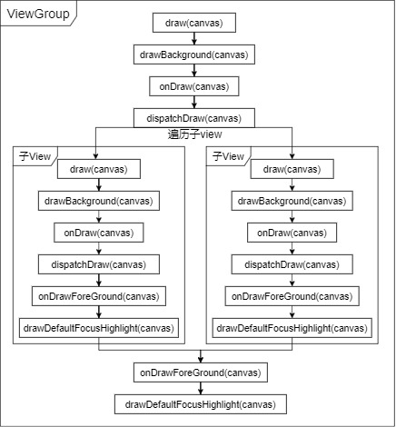

# View的Draw流程

1. **主体函数**

   `View.draw`，`View.drawBackground`，`View.onDraw`，`View.dispatchDraw`，`View.onDrawForeground`

2. **`draw(Canvas canvas)`**

   * 作用：根据给定的`Canvas`绘制`View`及其子`View`，并定义绘制方法的执行顺序。

   * 注意：

     * `draw`流程前必须完成`layout`流程
     * 所有的视图最终都是调用`View.draw`来完成绘制(`ViewGroup`中没有重写此方法)
     * 在自定义`View`中，不应重写`draw`方法，而应重写`onDraw`方法
     * 如果一定要重写`draw`，必须加上`super.draw(canvas)`，再进行自定义绘制

   * 相关源码：

     ```java
     android/view/View.java
     public void draw(Canvas canvas) {
         //第一步：绘制背景
         drawBackground(canvas);
         //检查是否有图层状态保存
         final int viewFlags = mViewFlags;
         boolean horizontalEdges = (viewFlags & FADING_EDGE_HORIZONTAL) != 0;
         boolean verticalEdges = (viewFlags & FADING_EDGE_VERTICAL) != 0;
         //如果没有，则跳过图层保存(第二步)恢复操作(第五步)，直接执行绘制，
         //所以，如果没必要，不要使用save-restore，可以提高绘制效率
         if (!verticalEdges && !horizontalEdges) {
             //第二步：绘制主体
             onDraw(canvas);
             //第三步：绘制子View
             dispatchDraw(canvas);
             //第四步：绘制前景(滑动条 前景等)
             onDrawForeground(canvas);
             //第五步：绘制焦点高亮处
             drawDefaultFocusHighlight(canvas);
             return;
         }
         //如果有图层状态，则执行下列步骤
         //第二步：保存图层状态
         ... ...
         if (drawTop) {
     		topSaveCount = canvas.saveUnclippedLayer(left, top, right, top + length);
     	}
     	if (drawBottom) {
     		bottomSaveCount = canvas.saveUnclippedLayer(left, bottom - length, right, bottom);
     	}
         if (drawLeft) {
     		leftSaveCount = canvas.saveUnclippedLayer(left, top, left + length, bottom);
     	}
         if (drawRight) {
     		rightSaveCount = canvas.saveUnclippedLayer(right - length, top, right, bottom);
     	}
         //第三步：绘制主体
         onDraw(canvas);
         //第四步：绘制子view
         dispatchDraw(canvas);
         //第五步：恢复图层状态
         canvas.restoreToCount(saveCount);
         //第六步：绘制装饰(前景 滑动条等)
         onDrawForeground(canvas);
     }
     ```

3. **`drawBackground(Canvas canvas)`**

   * 作用：绘制背景到`Canvas`上

   * 相关源码：

     ```java
     android/view/View.java
     private void drawBackground(Canvas canvas) {
         final Drawable background = mBackground;
         //根据layout流程后获取的位置信息来设置背景边界
         setBackgroundBounds();
         //根据x y是否有偏移量，决定是否需要移动画布
         final int scrollX = mScrollX;
     	final int scrollY = mScrollY;
     	if ((scrollX | scrollY) == 0) {
     		background.draw(canvas);
     	} else {
     		canvas.translate(scrollX, scrollY);
             //调用Drawable.draw绘制背景
     		background.draw(canvas);
     		canvas.translate(-scrollX, -scrollY);
     	}
     }
     ```

4. **`onDraw(Canvas canvas)`**

   * 作用：绘制`View`的主体内容，自定义`View`重写该方法，完成自身的绘制。

   * 相关源码：

     ```java
     android/view/View.java
     protected void onDraw(Canvas canvas) {}
     ```

5. **`dispatchDraw(Canvas canvas)`**

   * 作用：绘制子`View`的内容。一般`View`不需要重写，`ViewGroup`可以重写

   * 注意：此方法发生在自身的`onDraw`之后，但发生在子`View`的`draw`前

   * 相关源码：

     ```java
     android/view/View.java
     protected void dispatchDraw(Canvas canvas) {}
     ```

     ```java
     android/view/ViewGroup.java
     protected void dispatchDraw(Canvas canvas) {
         ... ...
         //绘制子view
         more |= drawChild(canvas, transientChild, drawingTime);
         ... ...
     }
     protected boolean drawChild(Canvas canvas, View child, long drawingTime) {
         //调用子View.draw
         return child.draw(canvas, this, drawingTime);
     }
     ```

6. **`onDrawForeground(Canvas canvas)`**

   * 作用：绘制前景(滑动条 前景等)，绘制在`View`的顶部。

   * 相关源码：

     ```java
     public void onDrawForeground(Canvas canvas) {
         //绘制滚动条及指示器
         onDrawScrollIndicators(canvas);
     	onDrawScrollBars(canvas);
     	final Drawable foreground = mForegroundInfo != null ? mForegroundInfo.mDrawable : null;
     	if (foreground != null) {
             //绘制前景
             foreground.draw(canvas);
     	}
     }
     ```

7. **简要流程**

   

   

8. **其他要点**

   * `View.setWillNotDraw(boolean willNotDraw)`：如果这个`View`不需要绘制自身，即`onDraw`方法，则可以设置为`true`，某一些`ViewGroup`会设置为`true`以进行优化绘制。
   
9. **系列文章**

   1. [View的背景知识](1KnowledgeBackground.md)
   2. [View的测量流程](2Measure.md)
   3. [View的布局流程](3Layout.md)
   4. [View的绘制背景知识](4DrawBackground.md)
   5. [View的绘制流程](5Draw.md)
   6. [View的三大绘制流程总结](6Conclusion.md)
   7. [View的事件分发机制](7Event.md)

